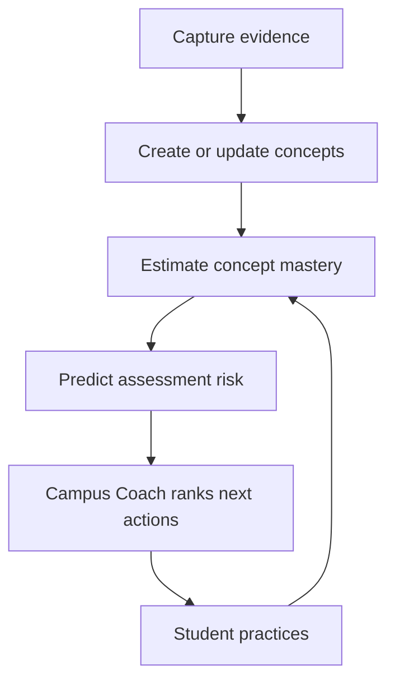

# Campus Companion — Product Source of Truth

**Status:** Canonical product plan
**Last updated:** August 8, 2026
**Launch direction:** Simple, trustworthy Fall 2026 beta
**Repository:** `Adrock4cini/campuscoach`

**Implementation status:** This is the canonical product plan, not a release
manifest. The focused PR #35 corrections passed Campus Companion CI #129 at
`a7123b1` but remain unmerged. Draft PR #37 contains the separate additive
Phase 0 item-level server foundation; its client cutover remains only a local
prototype. Neither effort is database-verified, deployed, or
outcome-validated. Deployed state remains `[UNKNOWN]`.

**Status key:** `[BUILT]` exists in the named code snapshot; `[PR]` is committed
to an open pull request; `[LOCAL PROTOTYPE]` exists only in an unmerged local
checkpoint; `[VERIFIED]` passed its named release gate; `[DEPLOYED]` is enabled
in a named environment; `[PROPOSED]` is planned but not implemented;
`[UNKNOWN]` has not been verified.

This document is the durable reference for product direction, learning truth,
scope, and sequencing. The code and migrations remain authoritative for what is
implemented. The older security and QA documents are historical references and
must be reconciled with current code and migrations before they are used as
release guidance.

When a material product decision changes, update this document in the same pull
request. Do not rely on a chat, mockup, or demo-only module as the final record.

## 1. Product identity

Use these names consistently unless a later branding decision replaces them:

| Name | Meaning |
| --- | --- |
| **Campus Companion** | The complete student product and app |
| **Campus Coach** | The decision-making experience that chooses and explains the student's next best action |
| **Campus Brain** | The student's private academic memory and the intelligence derived from it |
| **Class Coach** | The class-specific coaching and setup surface |

### Product promise

Campus Companion helps a busy college student answer three questions:

1. **What should I do next?**
2. **Why is that the best use of my limited time?**
3. **Will I still remember it when the test happens?**

The core-beta launch message is:

> **Know what to study. Remember it.**

The longer-term positioning may add **“Never get stuck alone”** only after the
human fallback is available and validated.

The product may help students improve preparedness and grades. It must not
promise that every student will pass a test until real outcome data supports
that claim.

## 2. Target student

The primary student is juggling classes, work, relationships,
extracurricular activities, and everyday life. The experience must work well
for students with ADHD or other executive-function challenges without
requiring them to learn a complicated system.

The default experience should be useful when the student has only 10–25
minutes available.

## 3. Non-negotiable product principles

1. **Reduce stress, friction, and decision load.** One clear next action is
   better than a wall of options.
2. **Keep the interface simple.** Prefer clear buttons, visual status, and short
   explanations over long text.
3. **Protect learning truth.** Capturing, opening, or reading material does not
   prove mastery.
4. **Explain recommendations.** Every recommendation needs student-readable
   evidence, not a mysterious score.
5. **Protect scope.** Class, course section, assignment, exam, source, and user
   boundaries must survive every handoff.
6. **Preserve provenance.** Concepts and practice must remain traceable to the
   student's source material.
7. **Be honest about uncertainty.** Low-confidence or conflicting material goes
   to verification before it becomes a quiz.
8. **Keep private work private.** Notes, captures, grades, readiness, mistakes,
   schedules, and messages are not automatically shared.
9. **Do not add a feature unless it makes the student's next useful action
   faster, safer, or more effective.**

## 4. Canonical architecture



The full loop is:

> **Capture → Concept → Mastery → Prediction → Coach → Study → Updated Mastery**

### Target durable memory versus disposable views

This table describes the target architecture, not deployed field completeness.
Draft PR #37 adds an item-level ledger and an independent v2 result endpoint,
but its migration is not database-verified or deployed and no production
client calls it. The deployed environment may still retain only aggregate
concept-level boolean outcomes. Verified
professor-emphasis evidence, exact assessment-concept relevance, prerequisites,
and stability remain Phase 1–2 work.

| Current durable data | Planned durable truth | Disposable and regeneratable |
| --- | --- | --- |
| Source captures and partial provenance; syllabus import does not retain the original file or field-level provenance | Canonical concept identity and deduplication | Flashcard and multiple-choice sets |
| Class, assignment, and exam records | Item-level scored retrieval evidence and pre-feedback confidence | Study guides and summaries |
| Concept rows and aggregate mastery/review timestamps | Exact assessment links, relevance, prerequisites, and stability | Practice-session presentation |
| Capture kind and professor-emphasis flag | Verification provenance, disputes, and invalidation history | Recommendation wording and UI cards |

Learning artifacts must never become the only memory of what the student knows.
The recommender reads permanent memory, not old flashcard rows.

## 5. Learning truth rules

These rules are product invariants, not optional enhancements:

1. **Unaided retrieval is the primary mastery signal.** A student must try to
   recall or solve before seeing the answer.
2. **Capture is evidence, not mastery.** Saving a note, image, syllabus, or
   professor comment must not increase readiness.
3. **Reading is not recall.** Viewing an explanation can support learning but
   cannot by itself raise mastery.
4. **Confidence must travel end to end.** If the UI asks how confident a student
   was, the production mastery update must use it. A confident wrong answer is
   a high-priority misconception; a low-confidence correct answer is not fully
   secure knowledge.
5. **Student confusion is not professor emphasis.** “I don't get this topic” is
   a private help signal. Only evidence that the professor emphasized something
   may set `professor_emphasis`.
6. **Ambiguous questions do not lower mastery.** A poorly grounded or disputed
   generated question goes to review/verification.
7. **Every assessed item needs concept attribution.** Results update the concept
   actually tested, not every concept in the set by default when attribution is
   available.
8. **Forgetting is time-dependent.** A strength value without time and a review
   interval is not a complete readiness estimate.

### Readiness definition

Current `0–100` readiness is an uncalibrated study index: the arithmetic mean of
stored concept strength within the selected class or exam scope. It includes
the current `0.15` discovery seed and does not model robust time decay. It is
not a probability of passing or a predicted grade.

Target readiness is a calibrated estimate of successful unaided retrieval on
the assessment date, reported with uncertainty. UI and marketing must not
describe it as a pass probability until the Phase 3 gate is met.

### Exam Scope Firewall

Every learning request must be bounded by:

`user → class/course instance → source → assignment or exam → concept → evidence`

Explicit links take precedence. Inferred links require sufficient confidence or
student confirmation. Material must never bleed between classes or assessments.

## 6. What Campus Coach should optimize

The Coach's governing question is:

> Given the student's remaining time, which concept and activity are most
> likely to recover the most assessment points and still be remembered on test
> day?

The product objective is **expected assessment points at risk per useful study
minute**. One candidate Phase 2 prediction model is:

```text
uncalibrated_predicted_recall =
  mastery_after_retrieval × 2^(-time_to_test / stability_half_life)

assessment_risk = assessment_weight
                × concept_relevance
                × urgency
                × (1 - uncalibrated_predicted_recall)

priority = assessment_risk
         × (1 + prerequisite_unlock_bonus)
         / max(2, expected_practice_minutes)
```

This equation assumes an exponential forgetting curve, a meaningful mastery
scale, and a calibrated stability parameter; Campus Companion has not
established any of those yet. It must not control readiness or consequential
scheduling until it is calibrated out of sample. Phase 1B uses the honest
fallback: exact assessment links, verified professor evidence, current
strength, due status, exam proximity, and expected minutes.

Initial relevance evidence can use this product heuristic, then be calibrated
against real outcomes:

```text
50% explicit exam guide, rubric, or topic-map evidence
30% verified professor emphasis
20% recurrence across lectures and assignments
```

An explicit professor statement about the assessment overrides the blended
heuristic. AI-only, peer-only, conflicting, or low-confidence evidence does not
silently become assessment truth.

## 7. Efficient study-session policy

Campus Coach should build a short adaptive session, not just open a generic
flashcard page.

1. Resolve any high-impact uncertainty in the source or assessment scope.
2. For introduced material, run a brief cold diagnostic using unaided
   retrieval. For genuinely new material, teach or show a worked example before
   the first mastery-eligible check.
3. Spend roughly 70% of the session on the highest-risk concepts.
4. Spend roughly 20% interleaving related material.
5. Spend roughly 10% repairing prerequisites that block the target concept.
6. Give immediate corrective feedback grounded in the student's source.
7. Update mastery, stability, and the next review time.
8. Re-rank the plan after the session.

### Proposed spacing policy

`[PROPOSED — Phase 2; not current behavior.]`

| Result | Initial follow-up |
| --- | --- |
| Wrong or needed the answer | Retry later in the session and again the next day |
| First unaided correct answer | About 1 day |
| Repeated unaided correct answers | Expand toward roughly 3, 7, and 14 days |
| Error after prior success | Contract the interval |
| Exam arrives sooner | Cap the review date before the exam |

The current RPC schedules incorrect results after four hours and correct
streaks at roughly 1, 2, 4, 8, and 16 days; it does not retry missed items later
in the same session. The table above is a product hypothesis to validate, not a
claim about current behavior.

## 8. Current implementation reality

### Working real-user path

| Layer | Status | Current implementation |
| --- | --- | --- |
| Capture | `[BUILT]`; deployment `[UNKNOWN]` | Authenticated typed notes, professor hints, assignment photos, material photos, and syllabus import |
| Concept | `[BUILT]`; deployment `[UNKNOWN]` | Edge functions extract concepts and preserve capture/class provenance |
| Artifact | `[BUILT]`; deployment `[UNKNOWN]` | Concept-backed flashcards and multiple-choice sets |
| Study | `[BUILT]` legacy path; `[LOCAL PROTOTYPE]` item path | The committed path collapses item outcomes by concept and submits client-derived correctness. A separate local prototype captures confidence before feedback and sends raw item responses without client-owned concept IDs or correctness |
| Mastery | `[BUILT]` legacy path; `[PR]` item-level server foundation | The committed RPC accepts concept-level booleans. Draft PR #37 derives item concepts and MCQ correctness from the stored artifact, applies confidence-aware updates, and treats positive flashcard self-report as practice rather than secure mastery; staging database acceptance remains open |
| Coach | `[BUILT]`; deployment `[UNKNOWN]` | Dashboard recommendation ranks weak, overdue concepts and nearby exams |
| Refresh | `[BUILT]`; deployment `[UNKNOWN]` | Completing study triggers a Coach refresh and re-ranking |
| Canvas | `[BUILT]` code; deployment `[UNKNOWN]` | Read-only OAuth and encrypted calendar-feed fallback code exist; institution configuration and deployment remain `[UNKNOWN]`. No password storage, submission, grade, or LMS writeback |

Important code paths:

- Capture: `src/components/capture/CaptureFlow.tsx`,
  `src/contexts/CaptureContext.tsx`,
  `src/lib/supabase/capturePersistence.ts`
- Concept extraction: `supabase/functions/extract-concepts/index.ts`,
  `supabase/functions/process-capture-images/index.ts`
- Artifact generation: `supabase/functions/generate-artifact/index.ts`,
  `src/lib/learningArtifacts/useLearningArtifact.ts`
- Study and results: `src/components/study/RealStudySet.tsx`,
  `src/components/study/RealStudyRunner.tsx`,
  `supabase/functions/record-study-result/index.ts`,
  `supabase/functions/record-study-result-v2/index.ts`
- Coach: `src/lib/coach/recommend.ts`,
  `src/lib/coach/useCoachRecommendations.ts`,
  `src/components/dashboard/RealCoachHero.tsx`

### Known truth and capability gaps

1. Concept extraction currently seeds a new mastery row at `0.15`. That is a
   bootstrap implementation detail, not demonstrated learning, and must not be
   presented as earned readiness.
2. Draft PR #37 repairs the server-side discarded-confidence and
   majority-collapse path while preserving an independent legacy v1 endpoint.
   Its client cutover remains a local prototype, it has not passed a real
   Postgres/RLS acceptance test, and the deployed legacy
   `apply_study_concept_result` RPC remains a caller-controlled boolean bypass
   until it is revoked after cutover.
3. PR #37 is an additive staging foundation, not a deploy authorization. Do not
   begin the side-by-side rollout until its migration, generated types, RPC
   privileges, RLS, idempotency, and concurrency behavior pass against a real
   staging database.
4. Syllabus import parses one PDF or photo into class and deadline fields, but
   does not retain a reopenable source file or field-level provenance.
   Confirmation is summary-level; safe merge and reconciliation, correction,
   post-save editing, and preservation of existing class details remain launch
   gaps.
5. Current capture code automatically emits aggregate capture and topic
   signals. Consent, canonical section identity, and a minimum cohort threshold
   have not been verified for beta. Treat shared aggregate intelligence as
   legacy or deferred until those gates pass.
6. The current ranker uses weakness, due/not-due review status, and broad exam
   proximity. It does not yet score verified professor emphasis, exact
   assessment relevance, overdue magnitude, stability, or expected minutes.
7. Real lecture recording and speech-to-text are not wired. The authenticated
   Record flow is currently simulated, so no production lecture transcript is
   feeding the concept pipeline yet.
8. Readiness does not yet model time-based decay robustly and can become stale
   after new concepts are added.
9. Assignment-linked captures exist, but a direct assignment-scoped artifact
   and recommendation policy is not complete.
10. Repeated captures can create duplicate concept rows; canonical concept
   resolution needs strengthening.
11. The real end-to-end loop lacks one database-backed integration test from
   capture through the next Coach recommendation.
12. Several `src/lib/intelligence/*` experiences are demo-oriented. They must not
   be used as evidence that the real production learner model supports the same
   behavior.
13. Grounding checks can reject thin input, but there is no verification queue or
   student dispute flow. A student cannot currently exclude or invalidate an
   ambiguous generated item before it affects mastery.
14. Owner-scoped authenticated clients still have direct write grants on
    `user_concept_mastery` because capture functions seed new concepts through
    the student's JWT. The supported UI does not write mastery directly, but
    the table is not tamper-resistant. Before readiness is used as externally
    trusted outcome data, move every seed/update behind audited RPCs and revoke
    direct authenticated mutation.

### Operating-cost boundary

The dated [1,000-DAU operating-cost model](campus-companion-cost-model.md)
estimates a provider-equivalent range of roughly **$1,138–$12,517 per month**,
with a base planning case near **$4,734**. Future lecture transcription accounts
for about 86% of that base case. These are planning assumptions, not observed
production spend or a vendor quote.

Launch rules:

- Do not sell unlimited recording.
- Start with a measured 600–900 transcription minutes per paid student/month.
- Compress and expire source media, cache generated study activities, and meter
  cost per student before raising limits.
- Re-estimate after a 50–100-student pilot using actual minutes, pages, tokens,
  retries, retention, and cache hits.
- Keep friend matching and messaging outside the cost promise until identity,
  message volume, retention, realtime load, and moderation are designed.

## 9. Roadmap and release gates

Do not run these phases as an unrestricted feature backlog. Each phase has a
gate that protects the next one. Status labels distinguish open pull requests
from local prototypes; neither means merged, deployed, or outcome-validated.

### Phase 0A — Focused PR #35 corrections

**Goal:** Preserve assignment scope and evidence integrity without expanding
the PR into the broader learning-engine cutover.

- `[PR]` Keep student confusion separate from professor emphasis.
- `[PR]` Preserve assignment identity through Help Me capture and practice
  flows.
- `[PR]` Stabilize the unrelated borderline sidebar test without changing
  global test timeouts.
- `[VERIFIED]` Campus Companion CI #129 passed lint, typecheck, 162 unit tests,
  build, and mobile and desktop smoke tests at `a7123b1`.

PR #35 remains open and unmerged.

### Phase 0B — Separate learning-truth cutover

**Goal:** Stop recording false or incomplete learning signals.

- `[LOCAL PROTOTYPE]` Capture confidence before feedback and send raw item
  responses without a client-owned correctness or concept field.
- `[PR]` Draft PR #37 adds an item-level ledger and RPC that derives concept
  attribution and MCQ correctness from the stored artifact.
- `[PR]` Draft PR #37 treats a positive flashcard self-rating as practice that
  does not raise secure mastery or postpone an earlier review.
- `[PR]` Draft PR #37 makes exact retries idempotent, rejects changed retries,
  preserves repeated items for one concept, and binds finalization to the
  active worker lease.
- `[PR]` Draft PR #37 preserves the legacy v1 implementation and isolates the
  item-level handler in `record-study-result-v2`.
- `[PROPOSED]` Apply the migration in a staging Supabase database and pass the
  full database/RLS acceptance suite; static SQL assertions are not enough.
- `[PROPOSED]` After the new edge function is live, revoke authenticated
  execution of legacy `apply_study_concept_result` in a separately ordered
  migration.
- `[PROPOSED]` Separate initial concept discovery from demonstrated
  mastery/readiness.

**Gate:** No supported app flow can silently create false professor evidence,
lose an explicit assignment boundary, claim to use a signal the server
discards, or bypass server-derived correctness. This gate remains open until
the database acceptance suite passes and the legacy RPC is revoked. Direct
table-write hardening remains required before readiness is treated as
externally trusted outcome data.

**Required cutover order:**

0. Preserve the legacy implementation in `record-study-result` and place the
   independent item-level implementation in `record-study-result-v2`. Draft PR
   #37 satisfies this source-level split; staging must verify it before cutover.
1. Apply `20260807200000_item_level_study_results.sql` to staging.
2. Deploy `record-study-result-v2` alongside the unchanged deployed v1 endpoint.
3. Deploy the web client that invokes v2. Existing open tabs may finish on v1
   while current clients use the server-derived contract.
4. Exercise objective MCQ, flashcard self-report, exact/changed retry,
   cross-user/class denial, completed-session denial, direct-ledger DML denial,
   and session-delete restriction against the real database.
5. After the v1 client drain window, revoke authenticated execution of
   `apply_study_concept_result` and retire v1 in a separate post-cutover
   release. Do not combine steps 1 and 5 into an unsequenced deployment.

### Phase 1A — Professor Signal Validation

**Goal:** Prove that the system can identify what matters before spending the
founder's time and money on microphone infrastructure.

- Run bounded, permission-cleared or de-identified real lecture transcripts
  through an offline, non-mutating fixture harness. Do not use the production
  capture seam until Phase 0 stops seeding discovery as `0.15` mastery.
- Extract explicit professor emphasis, repeated explanations, definitions,
  examples, corrections, and assignment directives with transcript evidence
  and confidence.
- Present a small “What mattered today” review and keep high-impact uncertain
  passages outside scored practice.
- Allow correction, rejection, and dispute without affecting mastery.
- Before persisting results, define transcript segments, many-source concept
  evidence, professor signals, exact assessment links, verification/invalidation
  state, and conservative same-class concept matching. Uncertain merges require
  review because canonical concept resolution is not built yet.
- Merely receiving, opening, or reading a transcript never changes mastery.

**Gate:** Every prototype output is manually reviewed; every surfaced signal
has valid transcript provenance; at least 80% of audited top-ranked concepts are
accepted as relevant; the reviewed set contains zero material errors in
assessment cues, formulas, dates, or assignment directives; lower-severity
signal errors are reported separately with sample size and uncertainty; and
uncertain or disputed material remains outside scored practice. Generated-item
correctness is measured separately in the priority-to-study handoff gate.

### Phase 1B — Narrow Priority-to-Study Handoff

**Goal:** Prove that “What mattered today” produces a better next study action
before microphone and storage work begins.

- Persist the minimum reviewed evidence contract after Phase 0 is closed.
- Rank with the honest fallback available now: exact assessment links, verified
  professor evidence, current strength, due status, exam proximity, and
  expected minutes.
- Preserve the exact ranked concept order into an exam-scoped flashcard or MCQ
  artifact and show the supporting source after feedback.
- Explain the top recommendation in student language.
- Put low-confidence high-impact evidence in verification.

**Gate:** Fixed evidence fixtures produce the expected rank order and
explanation; exact user/class/exam/source/concept boundaries survive the
handoff; 100% of generated items retain provenance; every initial pilot study
pack is manually reviewed before exposure; the reviewed set contains zero
material answer-key, formula, due-date, or rubric errors; lower-severity errors
are reported separately with sample size and uncertainty; and a disputed item
cannot update mastery.

### Phase 1C — Private Lecture Capture

**Goal:** Turn one permitted lecture into a trustworthy transcript without
retaining a permanent audio library.

- Process classroom audio in encrypted temporary chunks and delete it after a
  complete transcript is saved; failed/cancelled audio must be absent within 24
  hours.
- Preserve the exact section, lecture, source, timestamp, capture-time
  permission/notice basis, processing cost, and deletion audit evidence.
- Verify actual object absence or lifecycle expiry; a claimed deletion-status
  field alone is insufficient.
- Meter audio minutes and provider cost, enforce hard beta limits, and alert
  before the founder's budget is exceeded.
- Feed the transcript into the already-validated professor-signal and reviewed
  concept-evidence pipeline.
- Keep the first release private. Sharing permission, exact-section access,
  sanitization, reports, duplicate handling, and revocation are later gates.

**Gate:** At least 95% of bounded beta recordings produce a complete transcript,
100% retain a valid permission/notice basis, 100% of successful audio objects
are verified absent after transcription, failed audio is absent within 24
hours, the metering and budget limits fire in tests, and zero scope/access
incidents occur. In a permission-cleared calibration set, at least 95% of
audited high-impact segments must be accurate or correctly withheld from
practice, with zero materially wrong formulas, dates, assessment cues, or
assignment directives promoted into study. Word-error rate alone is not the
gate.

### Phase 2 — Retention Engine

**Goal:** Help the student remember material on the assessment date.

- Implement time-sensitive recall/stability estimates.
- Schedule transparent review intervals and contract them after errors.
- Adapt the session mix from diagnostic results.
- Re-rank immediately after each completed session.

**Gate:** Automated tests prove that correct, incorrect, confidence, elapsed
time, and exam date change mastery and review timing in the expected direction.
Fixture tests assert within-session retry, every interval transition, error
contraction, the maximum interval, and the exam-date cap.

The complete proposed item loop, context-dependent mode policy, assignment
stuck flow, lecture handoff, and release slices are defined in
[`study-lab-session-spec.md`](study-lab-session-spec.md). Its fixed schedules
and session mixes are hypotheses until pilot evidence validates them.

### Phase 3 — Outcome validation

**Goal:** Learn whether the Coach is actually helping.

- Measure recommendation starts and completions.
- Measure unaided retrieval improvement and scheduled-review completion.
- Compare predicted readiness with optional student-entered assessment results.
- Ask one short post-assessment question about usefulness and missing context.
- Monitor scope errors, unsupported questions, and recommendation overrides.

**Gate:** Before pilot enrollment, record the minimum analyzable sample,
comparator, horizon, and exclusion rules. Initial product thresholds are:

- 100% of scored items retain source and concept attribution.
- Every initial pilot study pack is manually reviewed before exposure and the
  reviewed set contains zero material answer-key, formula, due-date, or rubric
  errors. Report lower-severity errors separately with sample size and
  uncertainty; choose any later automated-production threshold from pilot
  evidence before inspecting the next validation set.
- Zero cross-user, cross-class, or cross-assessment scope leaks.
- At least a 10-percentage-point improvement in seven-day delayed recall over
  the preregistered baseline or comparator.
- Readiness calibration mean absolute error of at most 10 percentage points
  against delayed retrieval.
- At most 2% of answered items are disputed as invalid.

Change these thresholds only through a decision-log entry made before outcomes
are inspected.

A 20–30-student, 3–5-section pilot is a feasibility and preliminary-signal
study, not proof of general effectiveness. Any effectiveness claim requires an
adequately powered, prespecified comparison that accounts for section
clustering, attrition, uncertainty, and multiple outcomes.

### Phase 4 — Human fallback: Ask someone

**Goal:** Help a student get class-specific context when AI and captured sources
are insufficient.

- Start with user-approved plain text through the phone's native share sheet;
  this works before there is network density.
- Draft a concise assignment-scoped question for the student to approve.
- Share only a previewed snapshot containing the class label, assignment title,
  due date, and approved question. Do not share a private row, raw ID, capture,
  file, or access link.
- Treat peer answers about deadlines, rules, or expected work as unverified
  until confirmed by an authoritative source.
- Optimize for useful questions resolved, not time spent messaging.

**Gate:** The core learning loop is trustworthy, sharing is private by default,
and the flow helps at zero marketplace density.

### Phase 5 — Study Connections

**Goal:** Add mutual, class-scoped connections only where a real network exists.

- Establish a canonical shared course-section identity first: institution,
  term, course, section, and professor or verified LMS section.
- Define honest identity levels: **Campus verified** confirms institution only;
  **Class listed** is self-entered; **Invited connection** is mutually accepted;
  and **Section verified** requires an LMS, institution, or instructor source.
- Use mutual acceptance before messaging.
- Begin with expiring signed invites and text-only assignment threads,
  block/report controls, rate limits, defined retention, and moderation
  operations.
- Add opt-in classmate discovery only after an exact section has enough active
  students to provide useful matches. `[PROPOSED EXPERIMENT]` Begin with at
  least five opted-in, campus-verified, recently active students and at least
  three eligible candidates after blocks and preferences. Validate useful-match,
  privacy, and abuse outcomes; change the threshold only through the decision
  log before marketing discovery. Below the gate, show only “Invite someone you
  know”; do not reveal profiles or exact participant counts.
- Match on section, availability, study style, and self-declared topics where a
  student needs or can offer help—never on grades or private readiness.
- Establish an age/minor policy and academic-integrity rules before messaging.
  Allow logistics, concept explanations, and study planning; prohibit active
  quiz/exam answers, answer keys, or submitting another student's work.

**Gate:** Section identity, density, consent, RLS, abuse response, and moderation
are proven before discovery is marketed.

### Directed-sharing privacy rule

Before any in-app invite or messaging ships, create a current security and RLS
review, grounded in the deployed migrations, with a **directed shared content**
classification. Shared question context is a minimal sender-previewed snapshot;
it never grants access to the owner's
private class, assignment, capture, file, schedule, mastery, or readiness row.
Messages are participant-only, immediately block-aware, covered by a retention
policy, and excluded from Campus Brain training or aggregate intelligence by
default. A successful block must prevent all further contact.

The existing `InviteClassmatesModal` and invite-tracking code are prototypes,
not a production social foundation. They construct `/join?class=<private id>`
without a working join route or signed token, store events only in local
storage, and do not measure real section membership. Do not extend them into
messaging without replacing that identity and authorization model.

## 10. Social features explicitly deferred

Do not build these for the Fall 2026 core beta:

- A campus-wide friend graph or public social feed
- Random or anonymous chat
- Swipe-style matching
- Public profiles or campus-wide people search
- Group chat, photo/file exchange, voice, or video
- Location, last-seen status, read receipts, or social streaks
- Grade, readiness, diagnosis, schedule, activity, notes, email, or phone-based
  matching
- Automatic sharing of captures or mining private messages for AI training

The eventual one-to-one student relationship is a **Study Connection**, not a
generic friend request. Reserve **Study Circle** for a possible future group
feature; group messaging is currently deferred.

## 11. Success measures

### Core learning north star

**Useful study sessions completed from a Coach recommendation, followed by
improved unaided retrieval at the scheduled review.**

Supporting measures:

- Time from first capture to first grounded practice set
- Recommendation start, completion, and override rates
- Retrieval accuracy and confidence calibration over time
- Review completion before the relevant assessment
- Unsupported or disputed question rate
- Predicted readiness versus optional actual assessment result
- Student-reported “I knew what to do next” and “this helped me remember”
- Cross-class or cross-assessment scope incidents, with a target of zero

### Human fallback north star

**Assignment-scoped questions resolved usefully and safely.** Message count and
time in the social surface are not success metrics. Track reply and resolution
rate, median time to a useful answer, block/report rate, moderation response
time, and any attempted contact after blocking, with a target of zero successful
post-block contact.

## 12. Launch non-goals

The Fall 2026 beta does not need to:

- Support every study format
- Guarantee a passing grade
- Replace the professor, LMS, tutor, or accessibility office
- Complete or submit graded work, provide active quiz or exam answers, or
  impersonate the student
- Write grades, submissions, or completion state back to Canvas or another LMS
- Infer professor emphasis without evidence
- Build a full social network
- Make every demo intelligence screen production-real
- Automate a large plan when one clear next action is enough

Before beta publication, academic setup must pass a class-bound syllabus-import
journey that preserves existing class information, lets the student correct
extracted deadlines, supports assignment and exam editing, and reconciles
duplicates instead of silently appending or overwriting records.

The launch must prove one valuable closed loop:

> A student adds trustworthy class material, Campus Coach chooses an important
> concept, the student practices through retrieval, the system schedules the
> next review, and the next recommendation changes because of what happened.

## 13. Active decision log

| Date | Decision | Reason |
| --- | --- | --- |
| July 2026 | Concepts and user mastery are durable; study artifacts are disposable | Prevents UI artifacts from becoming the learner model |
| July 2026 | Use an Exam Scope Firewall with provenance and confirmation for uncertain links | Prevents class and assessment bleed |
| July 2026 | Default to one highest-value 10–25-minute action | Reduces decision load for busy students |
| August 7, 2026 | Prioritize learning truth, ranking, retention, and validation before broad social features | The product must first prove it helps a student study effectively |
| August 7, 2026 | Treat social as an assignment-scoped human fallback, then mutual Study Connections after section density | Provides value at zero density and avoids becoming a generic social network |
| August 7, 2026 | Keep PR #35 focused; repair its false signal and lost assignment handoffs without adding the broader learning engine or social layer | Keeps the change reviewable and protects data quality |
| August 7, 2026 | Assignment help teaches, explains, and provides practice; it does not complete or submit graded work or provide active-test answers | Protects academic integrity |
| August 7, 2026 | Canvas remains read-only and institution availability is verified separately; no LMS password storage or writeback | Protects source truth and student control |
| August 7, 2026 | The initial 5/3 Study Connection density rule is an experiment, not a validated fact | Prevents premature discovery claims |
| August 7, 2026 | Do not offer unlimited lecture recording; meter a starting 600–900 minutes and reprice from pilot usage | Transcription dominates the modeled 1,000-DAU operating cost |
| August 8, 2026 | Validate professor-signal extraction from bounded transcripts before building private lecture audio capture | Tests the product differentiator before spending on microphone and transcription infrastructure |
| August 8, 2026 | For introduced material, default Study Lab to retrieval before feedback and assessment-date-aware follow-up; teach genuinely new material first; treat exact mixes, intervals, confidence weights, and mastery deltas as pilot hypotheses | Preserves strong learning-science direction without presenting implementation heuristics as guarantees |

## 14. Working rules for future changes

Before adding or approving a feature, answer:

1. Which step of the canonical loop does it improve?
2. What durable data does it read or change?
3. What evidence supports the change?
4. Can it create false mastery, false professor emphasis, or scope bleed?
5. What is the smallest test that proves the handoff?
6. Does it make the student's next action simpler?
7. Is it launch-critical now, or should it remain explicitly deferred?

If those answers are unclear, the feature is not ready to build.
